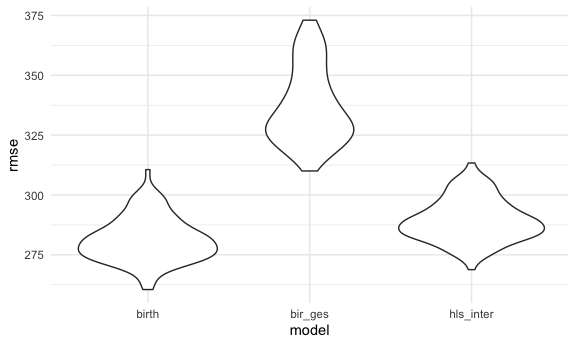
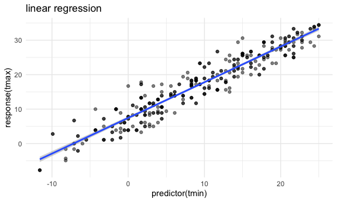

p8105\_hw6\_fc2691
================
fc2691
11/27/2021

## Problem 1

``` r
birth_data <- read.csv("./birthweight.csv") %>% 
  janitor::clean_names()
str(birth_data)
```

    ## 'data.frame':    4342 obs. of  20 variables:
    ##  $ babysex : int  2 1 2 1 2 1 2 2 1 1 ...
    ##  $ bhead   : int  34 34 36 34 34 33 33 33 36 33 ...
    ##  $ blength : int  51 48 50 52 52 52 46 49 52 50 ...
    ##  $ bwt     : int  3629 3062 3345 3062 3374 3374 2523 2778 3515 3459 ...
    ##  $ delwt   : int  177 156 148 157 156 129 126 140 146 169 ...
    ##  $ fincome : int  35 65 85 55 5 55 96 5 85 75 ...
    ##  $ frace   : int  1 2 1 1 1 1 2 1 1 2 ...
    ##  $ gaweeks : num  39.9 25.9 39.9 40 41.6 ...
    ##  $ malform : int  0 0 0 0 0 0 0 0 0 0 ...
    ##  $ menarche: int  13 14 12 14 13 12 14 12 11 12 ...
    ##  $ mheight : int  63 65 64 64 66 66 72 62 61 64 ...
    ##  $ momage  : int  36 25 29 18 20 23 29 19 13 19 ...
    ##  $ mrace   : int  1 2 1 1 1 1 2 1 1 2 ...
    ##  $ parity  : int  3 0 0 0 0 0 0 0 0 0 ...
    ##  $ pnumlbw : int  0 0 0 0 0 0 0 0 0 0 ...
    ##  $ pnumsga : int  0 0 0 0 0 0 0 0 0 0 ...
    ##  $ ppbmi   : num  26.3 21.3 23.6 21.8 21 ...
    ##  $ ppwt    : int  148 128 137 127 130 115 105 119 105 145 ...
    ##  $ smoken  : num  0 0 1 10 1 0 0 0 0 4 ...
    ##  $ wtgain  : int  29 28 11 30 26 14 21 21 41 24 ...

``` r
#Change numeric to factors appropriately
col_fac <- c(1, 7, 9, 13:16) 
birth_data[,col_fac] <- lapply(birth_data[,col_fac] , factor)
str(birth_data)
```

    ## 'data.frame':    4342 obs. of  20 variables:
    ##  $ babysex : Factor w/ 2 levels "1","2": 2 1 2 1 2 1 2 2 1 1 ...
    ##  $ bhead   : int  34 34 36 34 34 33 33 33 36 33 ...
    ##  $ blength : int  51 48 50 52 52 52 46 49 52 50 ...
    ##  $ bwt     : int  3629 3062 3345 3062 3374 3374 2523 2778 3515 3459 ...
    ##  $ delwt   : int  177 156 148 157 156 129 126 140 146 169 ...
    ##  $ fincome : int  35 65 85 55 5 55 96 5 85 75 ...
    ##  $ frace   : Factor w/ 5 levels "1","2","3","4",..: 1 2 1 1 1 1 2 1 1 2 ...
    ##  $ gaweeks : num  39.9 25.9 39.9 40 41.6 ...
    ##  $ malform : Factor w/ 2 levels "0","1": 1 1 1 1 1 1 1 1 1 1 ...
    ##  $ menarche: int  13 14 12 14 13 12 14 12 11 12 ...
    ##  $ mheight : int  63 65 64 64 66 66 72 62 61 64 ...
    ##  $ momage  : int  36 25 29 18 20 23 29 19 13 19 ...
    ##  $ mrace   : Factor w/ 4 levels "1","2","3","4": 1 2 1 1 1 1 2 1 1 2 ...
    ##  $ parity  : Factor w/ 4 levels "0","1","3","6": 3 1 1 1 1 1 1 1 1 1 ...
    ##  $ pnumlbw : Factor w/ 1 level "0": 1 1 1 1 1 1 1 1 1 1 ...
    ##  $ pnumsga : Factor w/ 1 level "0": 1 1 1 1 1 1 1 1 1 1 ...
    ##  $ ppbmi   : num  26.3 21.3 23.6 21.8 21 ...
    ##  $ ppwt    : int  148 128 137 127 130 115 105 119 105 145 ...
    ##  $ smoken  : num  0 0 1 10 1 0 0 0 0 4 ...
    ##  $ wtgain  : int  29 28 11 30 26 14 21 21 41 24 ...

``` r
kable(birth_data[1:10,])
```

| babysex | bhead | blength |  bwt | delwt | fincome | frace | gaweeks | malform | menarche | mheight | momage | mrace | parity | pnumlbw | pnumsga |    ppbmi | ppwt | smoken | wtgain |
|:--------|------:|--------:|-----:|------:|--------:|:------|--------:|:--------|---------:|--------:|-------:|:------|:-------|:--------|:--------|---------:|-----:|-------:|-------:|
| 2       |    34 |      51 | 3629 |   177 |      35 | 1     |    39.9 | 0       |       13 |      63 |     36 | 1     | 3      | 0       | 0       | 26.27184 |  148 |      0 |     29 |
| 1       |    34 |      48 | 3062 |   156 |      65 | 2     |    25.9 | 0       |       14 |      65 |     25 | 2     | 0      | 0       | 0       | 21.34485 |  128 |      0 |     28 |
| 2       |    36 |      50 | 3345 |   148 |      85 | 1     |    39.9 | 0       |       12 |      64 |     29 | 1     | 0      | 0       | 0       | 23.56517 |  137 |      1 |     11 |
| 1       |    34 |      52 | 3062 |   157 |      55 | 1     |    40.0 | 0       |       14 |      64 |     18 | 1     | 0      | 0       | 0       | 21.84508 |  127 |     10 |     30 |
| 2       |    34 |      52 | 3374 |   156 |       5 | 1     |    41.6 | 0       |       13 |      66 |     20 | 1     | 0      | 0       | 0       | 21.02642 |  130 |      1 |     26 |
| 1       |    33 |      52 | 3374 |   129 |      55 | 1     |    40.7 | 0       |       12 |      66 |     23 | 1     | 0      | 0       | 0       | 18.60030 |  115 |      0 |     14 |
| 2       |    33 |      46 | 2523 |   126 |      96 | 2     |    40.3 | 0       |       14 |      72 |     29 | 2     | 0      | 0       | 0       | 14.27034 |  105 |      0 |     21 |
| 2       |    33 |      49 | 2778 |   140 |       5 | 1     |    37.4 | 0       |       12 |      62 |     19 | 1     | 0      | 0       | 0       | 21.81089 |  119 |      0 |     21 |
| 1       |    36 |      52 | 3515 |   146 |      85 | 1     |    40.3 | 0       |       11 |      61 |     13 | 1     | 0      | 0       | 0       | 19.88106 |  105 |      0 |     41 |
| 1       |    33 |      50 | 3459 |   169 |      75 | 2     |    40.7 | 0       |       12 |      64 |     19 | 2     | 0      | 0       | 0       | 24.94123 |  145 |      4 |     24 |

``` r
#Checking for missing data
sum(is.na(birth_data))
```

    ## [1] 0

``` r
options(na.action = na.warn)

#Take a look at the birthweight distribution
summary(birth_data$bwt)
```

    ##    Min. 1st Qu.  Median    Mean 3rd Qu.    Max. 
    ##     595    2807    3132    3114    3459    4791

``` r
hist(birth_data$bwt, main = "Histogram of birthweight", xlab = "Birthweight") 
```


There is no missing data in this database. The data mean number is
nearly same as the median number. With the combination of histogram,
birthweight parameter nearly follows the normal distribution.

After cleaning the dataset, I use backward elimination to select
variables(predictions) and build regression models.

``` r
# Prepare data for linear model
birth_prep <- 
  birth_data %>% 
  select(-babysex, -frace, -malform, -mrace, -parity, -pnumlbw, -pnumsga, -wtgain)

# Fit using all predictors
birth_model = lm(bwt ~ ., data = birth_prep)
summary(birth_model)
```

    ## 
    ## Call:
    ## lm(formula = bwt ~ ., data = birth_prep)
    ## 
    ## Residuals:
    ##      Min       1Q   Median       3Q      Max 
    ## -1078.50  -182.97    -6.33   175.97  2477.58 
    ## 
    ## Coefficients:
    ##               Estimate Std. Error t value Pr(>|t|)    
    ## (Intercept) -6636.2181   671.3628  -9.885  < 2e-16 ***
    ## bhead         132.4948     3.4679  38.206  < 2e-16 ***
    ## blength        77.2698     2.0555  37.591  < 2e-16 ***
    ## delwt           3.9891     0.4027   9.907  < 2e-16 ***
    ## fincome         0.9959     0.1746   5.705 1.24e-08 ***
    ## gaweeks        13.0344     1.4820   8.795  < 2e-16 ***
    ## menarche       -5.6717     2.9502  -1.923   0.0546 .  
    ## mheight        10.3940    10.4917   0.991   0.3219    
    ## momage          4.6884     1.1948   3.924 8.84e-05 ***
    ## ppbmi           2.8443    15.1798   0.187   0.8514    
    ## ppwt           -3.4349     2.6640  -1.289   0.1973    
    ## smoken         -2.8946     0.5780  -5.008 5.71e-07 ***
    ## ---
    ## Signif. codes:  0 '***' 0.001 '**' 0.01 '*' 0.05 '.' 0.1 ' ' 1
    ## 
    ## Residual standard error: 278.5 on 4330 degrees of freedom
    ## Multiple R-squared:  0.7051, Adjusted R-squared:  0.7043 
    ## F-statistic:   941 on 11 and 4330 DF,  p-value: < 2.2e-16

``` r
#Take out ppbmi
birth_model = update(birth_model, . ~ . -ppbmi)
summary(birth_model)
```

    ## 
    ## Call:
    ## lm(formula = bwt ~ bhead + blength + delwt + fincome + gaweeks + 
    ##     menarche + mheight + momage + ppwt + smoken, data = birth_prep)
    ## 
    ## Residuals:
    ##      Min       1Q   Median       3Q      Max 
    ## -1078.45  -182.79    -6.37   175.87  2477.56 
    ## 
    ## Coefficients:
    ##               Estimate Std. Error t value Pr(>|t|)    
    ## (Intercept) -6513.0511   136.5315 -47.704  < 2e-16 ***
    ## bhead         132.5129     3.4662  38.230  < 2e-16 ***
    ## blength        77.2713     2.0553  37.596  < 2e-16 ***
    ## delwt           3.9884     0.4026   9.907  < 2e-16 ***
    ## fincome         0.9966     0.1745   5.710 1.20e-08 ***
    ## gaweeks        13.0324     1.4818   8.795  < 2e-16 ***
    ## menarche       -5.6880     2.9486  -1.929   0.0538 .  
    ## mheight         8.4574     1.8019   4.693 2.77e-06 ***
    ## momage          4.6903     1.1946   3.926 8.76e-05 ***
    ## ppwt           -2.9426     0.4410  -6.673 2.83e-11 ***
    ## smoken         -2.8956     0.5779  -5.011 5.64e-07 ***
    ## ---
    ## Signif. codes:  0 '***' 0.001 '**' 0.01 '*' 0.05 '.' 0.1 ' ' 1
    ## 
    ## Residual standard error: 278.5 on 4331 degrees of freedom
    ## Multiple R-squared:  0.7051, Adjusted R-squared:  0.7044 
    ## F-statistic:  1035 on 10 and 4331 DF,  p-value: < 2.2e-16

``` r
#Take out menarche
birth_model = update(birth_model, . ~ . -menarche)
summary(birth_model)
```

    ## 
    ## Call:
    ## lm(formula = bwt ~ bhead + blength + delwt + fincome + gaweeks + 
    ##     mheight + momage + ppwt + smoken, data = birth_prep)
    ## 
    ## Residuals:
    ##      Min       1Q   Median       3Q      Max 
    ## -1068.57  -182.27    -6.23   174.97  2495.66 
    ## 
    ## Coefficients:
    ##               Estimate Std. Error t value Pr(>|t|)    
    ## (Intercept) -6560.4726   134.3423 -48.834  < 2e-16 ***
    ## bhead         132.4132     3.4669  38.194  < 2e-16 ***
    ## blength        77.3697     2.0553  37.644  < 2e-16 ***
    ## delwt           4.0209     0.4024   9.993  < 2e-16 ***
    ## fincome         1.0224     0.1741   5.874 4.58e-09 ***
    ## gaweeks        13.0445     1.4823   8.800  < 2e-16 ***
    ## mheight         8.0420     1.7896   4.494 7.18e-06 ***
    ## momage          4.2486     1.1728   3.623 0.000295 ***
    ## ppwt           -2.9125     0.4409  -6.606 4.41e-11 ***
    ## smoken         -2.9016     0.5780  -5.020 5.38e-07 ***
    ## ---
    ## Signif. codes:  0 '***' 0.001 '**' 0.01 '*' 0.05 '.' 0.1 ' ' 1
    ## 
    ## Residual standard error: 278.5 on 4332 degrees of freedom
    ## Multiple R-squared:  0.7048, Adjusted R-squared:  0.7042 
    ## F-statistic:  1149 on 9 and 4332 DF,  p-value: < 2.2e-16

``` r
plot(birth_model)
```


``` r
#Tidying output
birth_model %>% 
  broom::tidy() %>% 
  select(term, estimate, p.value)
```

    ## # A tibble: 10 × 3
    ##    term        estimate   p.value
    ##    <chr>          <dbl>     <dbl>
    ##  1 (Intercept) -6560.   0        
    ##  2 bhead         132.   2.33e-275
    ##  3 blength        77.4  1.48e-268
    ##  4 delwt           4.02 2.92e- 23
    ##  5 fincome         1.02 4.58e-  9
    ##  6 gaweeks        13.0  1.94e- 18
    ##  7 mheight         8.04 7.18e-  6
    ##  8 momage          4.25 2.95e-  4
    ##  9 ppwt           -2.91 4.41e- 11
    ## 10 smoken         -2.90 5.38e-  7

``` r
coef(birth_model)
```

    ##  (Intercept)        bhead      blength        delwt      fincome      gaweeks 
    ## -6560.472631   132.413188    77.369706     4.020858     1.022405    13.044538 
    ##      mheight       momage         ppwt       smoken 
    ##     8.041951     4.248562    -2.912498    -2.901568

Thus I get the regression model:  
Y =
-6560.47+132.41\*bhead+77.37\*blength+4.02\*delwt+1.022\*fincome+13.04\*gaweeks+8.042\*mheight+4.249\*momage+(-2.912)\*ppwt+(-2.902)\*smoken  
Then using add\_predictions and add\_residuals to diagnostic and make a
plot.

``` r
birth_data %>% 
  modelr::add_residuals(birth_model) %>%
  modelr::add_predictions(birth_model) %>% 
  select(resid, pred) %>% 
  ggplot(aes(x = pred, y = resid)) + 
  geom_point()
```


Now it is time to compare model to two others linear models with
different predictors:

-   One using length at birth and gestational age as predictors (main
    effects only)  
-   One using head circumference, length, sex, and all interactions
    (including the three-way interaction) between these. Thus I get the
    two new linear regression models:

``` r
# Linear regression for other two regression models. 
birth_gest_model <- lm(bwt ~ blength + gaweeks, data = birth_data)
summary(birth_gest_model)
```

    ## 
    ## Call:
    ## lm(formula = bwt ~ blength + gaweeks, data = birth_data)
    ## 
    ## Residuals:
    ##     Min      1Q  Median      3Q     Max 
    ## -1709.6  -215.4   -11.4   208.2  4188.8 
    ## 
    ## Coefficients:
    ##              Estimate Std. Error t value Pr(>|t|)    
    ## (Intercept) -4347.667     97.958  -44.38   <2e-16 ***
    ## blength       128.556      1.990   64.60   <2e-16 ***
    ## gaweeks        27.047      1.718   15.74   <2e-16 ***
    ## ---
    ## Signif. codes:  0 '***' 0.001 '**' 0.01 '*' 0.05 '.' 0.1 ' ' 1
    ## 
    ## Residual standard error: 333.2 on 4339 degrees of freedom
    ## Multiple R-squared:  0.5769, Adjusted R-squared:  0.5767 
    ## F-statistic:  2958 on 2 and 4339 DF,  p-value: < 2.2e-16

``` r
head_length_sex_inter_model <- lm(bwt ~ bhead * blength * babysex, data = birth_data)
summary(head_length_sex_inter_model)
```

    ## 
    ## Call:
    ## lm(formula = bwt ~ bhead * blength * babysex, data = birth_data)
    ## 
    ## Residuals:
    ##      Min       1Q   Median       3Q      Max 
    ## -1132.99  -190.42   -10.33   178.63  2617.96 
    ## 
    ## Coefficients:
    ##                          Estimate Std. Error t value Pr(>|t|)    
    ## (Intercept)            -7176.8170  1264.8397  -5.674 1.49e-08 ***
    ## bhead                    181.7956    38.0542   4.777 1.84e-06 ***
    ## blength                  102.1269    26.2118   3.896 9.92e-05 ***
    ## babysex2                6374.8684  1677.7669   3.800 0.000147 ***
    ## bhead:blength             -0.5536     0.7802  -0.710 0.478012    
    ## bhead:babysex2          -198.3932    51.0917  -3.883 0.000105 ***
    ## blength:babysex2        -123.7729    35.1185  -3.524 0.000429 ***
    ## bhead:blength:babysex2     3.8781     1.0566   3.670 0.000245 ***
    ## ---
    ## Signif. codes:  0 '***' 0.001 '**' 0.01 '*' 0.05 '.' 0.1 ' ' 1
    ## 
    ## Residual standard error: 287.7 on 4334 degrees of freedom
    ## Multiple R-squared:  0.6849, Adjusted R-squared:  0.6844 
    ## F-statistic:  1346 on 7 and 4334 DF,  p-value: < 2.2e-16

``` r
# Calculate the cross-validated prediction error. 
cv_birth =
  crossv_mc(birth_data, 100) %>% 
  mutate(
    train = map(train, as_tibble),
    test = map(test, as_tibble))

# RMSE and fit models. 
cv_birth <- 
  cv_birth %>% 
  mutate(
    birth_model = map(train, ~lm(bwt ~ bhead + blength + delwt + fincome + gaweeks + mheight + momage + ppwt + smoken, data = .x)), 
    birth_gest_model = map(train, ~lm(bwt ~ blength + gaweeks, data = .x)), 
    head_length_sex_inter_model = map(train, ~lm(bwt ~ bhead * blength * babysex, data = birth_data), data = .x)) %>% 
  mutate(
    rmse_birth = map2_dbl(birth_model, test, ~rmse(model = .x, data = .y)),
    rmse_bir_ges = map2_dbl(birth_gest_model, test, ~rmse(model = .x, data = .y)),
    rmse_hls_inter = map2_dbl(head_length_sex_inter_model, test, ~rmse(model = .x, data = .y)))

# Draw a plot to show RMSE distribution
cv_birth %>% 
  select(starts_with("rmse")) %>% 
  pivot_longer(
    everything(),
    names_to = "model", 
    values_to = "rmse",
    names_prefix = "rmse_") %>% 
  mutate(model = fct_inorder(model)) %>% 
  ggplot(aes(x = model, y = rmse)) + geom_violin()
```


Compared to two other linear models, the root mean square error with my
9 predictors is the lowest on average. And the rmse difference between
my model and that three way interactions is not that largem while models
using birthlength and gestational age has the largest rmse overall.
After all, my linear regression model the best at predicting observation
data among those three.  
\#\# Problem 2

``` r
weather_df = 
  rnoaa::meteo_pull_monitors(
    c("USW00094728"),
    var = c("PRCP", "TMIN", "TMAX"), 
    date_min = "2017-01-01",
    date_max = "2017-12-31") %>%
  mutate(
    name = recode(id, USW00094728 = "CentralPark_NY"),
    tmin = tmin / 10,
    tmax = tmax / 10) %>%
  select(name, id, everything())
```

``` r
set.seed(1)

# Build bootstrap function
boot_sample = function(df) {
  sample_frac(df, replace = TRUE)
}

boot_sample(weather_df) %>% 
  ggplot(aes(x = tmin, y = tmax)) + 
  geom_point(alpha = .5) +
  stat_smooth(method = "lm") +
  labs(title = "linear regression", x =  "predictor(tmin)", y = "response(tmax)")
```

    ## `geom_smooth()` using formula 'y ~ x'



The plot shows the association between the predictor(tmin) and
response(tmax).

``` r
weather_boot <- 
  data_frame(
    strap_number = 1:5000,
    strap_sample = rerun(5000, boot_sample(weather_df))
  )
```

    ## Warning: `data_frame()` was deprecated in tibble 1.1.0.
    ## Please use `tibble()` instead.
    ## This warning is displayed once every 8 hours.
    ## Call `lifecycle::last_warnings()` to see where this warning was generated.

``` r
# Bootstrap Analysis
weather_results <- 
  weather_boot %>% 
  mutate(
    models = map(strap_sample, ~lm(tmax ~ tmin, data = .x) ),
    results = map(models, broom::tidy)) %>% 
  select(-strap_sample) %>% 
  unnest(results) %>% 
  select(-std.error, -statistic, -p.value) %>% 
  pivot_wider(names_from = term, 
              values_from = estimate) %>% 
  janitor::clean_names() %>% 
  mutate(log_b0b1 = log(intercept * tmin), 
         r_square = map(models, broom::glance)) %>% 
  select(strap_number, log_b0b1, r_square) %>% 
  unnest(r_square)
```

Then two plots will be shown for those two estimates.

``` r
log_b0b1_plot <- 
  weather_results %>% 
  ggplot(aes(x = log_b0b1)) +
  geom_histogram()

log_r_square_plot <- 
  weather_results %>% 
  ggplot(aes(x = r.squared)) +
  geom_histogram()

log_b0b1_plot + log_r_square_plot + plot_annotation(
  title = 'Distribution for log and rsquare')
```

    ## `stat_bin()` using `bins = 30`. Pick better value with `binwidth`.
    ## `stat_bin()` using `bins = 30`. Pick better value with `binwidth`.


Both logb0b1 and r^2 are nearly normally distributed, and the average
value for logb0b1 and r^2 are nearly locate around 2.02 and 0.91

``` r
#95% confidence
weather_results_ci <-
  weather_results %>% 
  summarize(
    r_square_ci_lower = quantile(r.squared, 0.025), 
    r_square_ci_upper = quantile(r.squared, 0.975), 
    log_ci_lower = quantile(log_b0b1, 0.025), 
    log_ci_upper = quantile(log_b0b1, 0.975))
weather_results_ci
```

    ## # A tibble: 1 × 4
    ##   r_square_ci_lower r_square_ci_upper log_ci_lower log_ci_upper
    ##               <dbl>             <dbl>        <dbl>        <dbl>
    ## 1             0.894             0.927         1.96         2.06

When trying to find confidence interval for those two estimates with a
significance level of 95%. I get confidence interval (0.894, 0.927) for
r^2, and confidence interval(1.965, 2.059) for log(b0\*b1).
